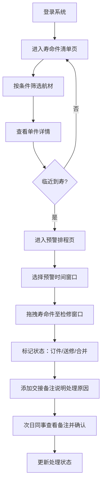

## 1. 产品概述

面向航空公司航材计划员的Web寿命件追踪台账系统，聚焦发动机LLP（寿命件）、起落架大修件、应急设备等带寿命限制的航材管理，解决寿命件追踪难、预警不及时、交接班信息断层等核心痛点。

- 目标用户：航空公司航材计划员（白班/夜班轮值）
- 核心价值：确保航材寿命可控、预警及时、交接清晰，避免因寿命件到期未处理导致的航班延误或安全隐患

## 2. 核心功能

### 2.1 用户角色

| 角色 | 登录方式 | 核心权限 |
|------|----------|----------|
| 航材计划员 | 内部系统账号 | 查看寿命件清单、管理预警排程、添加交接备注 |
| 夜班计划员 | 内部系统账号 | 全部计划员权限 + 交接备注标记待确认 |
| 主管 | 内部系统账号 | 全部权限 + 数据导出与报表 |

### 2.2 功能模块

1. **寿命件清单页**：多维度筛选列表、单件详情弹窗（装机位置、拆装记录、适航依据、预计到寿）
2. **预警排程页**：按时间/循环维度风险列表、拖拽排程、检修状态标记（订件/送修/合并定检）
3. **交接备注**：夜班备注记录、处理状态流转、待确认事项高亮

### 2.3 页面详情

| 页面名称 | 模块名称 | 功能描述 |
|----------|----------|----------|
| 寿命件清单 | 顶部筛选栏 | 件号、序号、装机飞机、剩余循环范围、日历寿命范围筛选 |
| 寿命件清单 | 数据表格 | 展示件号、序号、名称、类别、装机飞机、剩余循环、剩余天数、状态标签 |
| 寿命件清单 | 详情弹窗 | 当前装机位置、上次拆装记录（时间/地点/原因）、适航文件依据、预计到寿日期 |
| 预警排程 | 时间筛选器 | 30天/60天/90天/自定义循环数 切换 |
| 预警排程 | 风险列表 | 按风险等级排序的寿命件卡片（红/橙/黄三色分级） |
| 预警排程 | 计划检修窗口 | 拖拽目标区域，支持拖入寿命件排程 |
| 预警排程 | 状态标记 | 需订件、需送修、可与定检合并 三种标记及切换 |
| 全局组件 | 交接备注面板 | 备注列表（时间/人员/内容）、新增备注、状态标记（待处理/处理中/已确认） |

## 3. 核心流程

计划员日常工作流程：

## 4. 用户界面设计

### 4.1 设计风格

- **主色调**：航空深蓝 `#1e3a5f`（专业、信赖）+ 警戒橙 `#e86a2c`（预警）
- **辅助色**：安全绿 `#2e7d52`、告警红 `#c53030`、提示黄 `#d69e2e`
- **中性色**：深灰 `#1a202c`、中灰 `#4a5568`、浅灰 `#e2e8f0`、白 `#f7fafc`
- **字体**：标题用 "Noto Sans SC" 700；正文用 "Noto Sans SC" 400；数据用 "JetBrains Mono" 等宽
- **按钮风格**：微圆角(6px)、2px边框、悬停时轻微上浮阴影
- **布局风格**：顶部导航栏 + 左侧状态摘要 + 右侧主内容区（仪表盘式）
- **图标**：lucide-react 线性图标，保持统一线宽

### 4.2 页面设计概览

| 页面名称 | 模块名称 | UI元素 |
|----------|----------|--------|
| 寿命件清单 | 顶部筛选栏 | 横向排列的输入框+下拉选择器+搜索按钮，深蓝背景卡片 |
| 寿命件清单 | 数据表格 | 斑马纹行，风险等级用左侧色条标识，悬停高亮 |
| 寿命件清单 | 详情弹窗 | 左侧关键指标卡，右侧时间线式拆装记录，底部适航文件链接 |
| 预警排程 | 时间筛选器 | 胶囊式分段按钮，选中项深蓝填充 |
| 预警排程 | 风险列表 | 卡片网格布局，红橙黄三色左侧边条，底部拖拽手柄 |
| 预警排程 | 检修窗口 | 虚线边框区域，拖入高亮，内部时间轴布局 |
| 预警排程 | 状态标记 | 圆形三色选择器，选中打勾动画 |
| 全局 | 交接备注 | 抽屉式右侧面板，气泡式对话列表，底部输入框 |

### 4.3 响应式设计

- Desktop-first，优先支持 1440×900 及以上（计划员多用大屏工作站）
- 平板适配：筛选栏换行堆叠，表格支持横向滚动
- 移动端：卡片列表代替表格，预警排程改为上下分区

### 4.4 动效与交互

- 页面载入：顶部导航淡入 → 侧边栏滑入 → 主内容错峰浮现（stagger 80ms）
- 拖拽交互：抓起时卡片缩放0.98+阴影加深，放下时回弹
- 风险等级色条：呼吸动画（opacity 0.7→1），红色告警频率更高
- 状态切换：打勾图标描边动画
