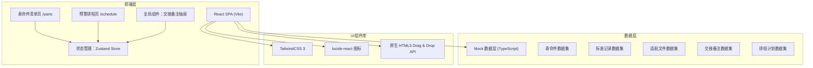

## 1. 架构设计



## 2. 技术选型说明

- **前端框架**：React 18 + TypeScript 5 — 强类型支撑航材数据严谨性，React生态成熟
- **构建工具**：Vite 5 — 开发服务器启动快，HMR体验好
- **样式方案**：TailwindCSS 3 — 快速构建专业仪表盘风格界面，设计令牌一致
- **状态管理**：Zustand — 轻量级，避免Redux繁琐，适合中小规模业务状态
- **图标库**：lucide-react — 线性风格，符合航空专业审美
- **拖拽方案**：原生 HTML5 Drag & Drop API — 无需额外依赖，满足简单拖拽排程
- **数据方案**：本地 TypeScript Mock 数据 — 无需后端即可完整演示功能，后续可平滑接入API

## 3. 路由定义

| 路由路径 | 页面用途 |
|----------|----------|
| `/` | 重定向至 `/parts` |
| `/parts` | 寿命件清单页（首页） |
| `/schedule` | 预警排程页 |

## 4. 数据模型（TypeScript 类型定义）

```typescript
// 寿命件类型
type PartCategory = 'ENGINE_LLP' | 'LANDING_GEAR' | 'EMERGENCY_EQ' | 'OTHER';
type RiskLevel = 'CRITICAL' | 'WARNING' | 'CAUTION' | 'NORMAL';
type ScheduleStatus = 'NONE' | 'NEED_ORDER' | 'NEED_REPAIR' | 'MERGE_CHECK';
type HandoverStatus = 'PENDING' | 'IN_PROGRESS' | 'CONFIRMED';

interface LifePart {
  id: string;
  partNumber: string;        // 件号
  serialNumber: string;      // 序号
  name: string;              // 名称
  category: PartCategory;    // 类别
  aircraftReg: string;       // 装机飞机注册号 B-xxxx
  installPosition: string;   // 当前装机位置 如"左发#1风扇盘"
  totalCycles: number;       // 额定总循环
  usedCycles: number;        // 已用循环
  remainingCycles: number;   // 剩余循环
  totalDays: number;         // 额定日历天数
  usedDays: number;          // 已用天数
  remainingDays: number;     // 剩余天数
  expiryDate: string;        // 预计到寿日期 YYYY-MM-DD
  riskLevel: RiskLevel;      // 风险等级
  scheduleStatus: ScheduleStatus;
  isScheduled: boolean;      // 是否已排入检修计划
  scheduledDate?: string;    // 计划检修日期
  lastRemoval?: RemovalRecord;
  airworthinessRefs: string[]; // 适航文件编号列表
}

interface RemovalRecord {
  id: string;
  partId: string;
  date: string;
  station: string;           // 拆装站点
  reason: string;            // 拆装原因
  fromPosition: string;      // 拆下位置
  toAircraft?: string;       // 新装飞机（如有）
  operator: string;          // 操作人
}

interface AirworthinessDoc {
  docNumber: string;
  title: string;
  issueDate: string;
  authority: 'CAAC' | 'FAA' | 'EASA';
  link: string;
}

interface HandoverNote {
  id: string;
  partId: string;
  content: string;
  author: string;
  authorRole: 'DAY_SHIFT' | 'NIGHT_SHIFT' | 'SUPERVISOR';
  createdAt: string;
  status: HandoverStatus;
  confirmedBy?: string;
  confirmedAt?: string;
}
```

## 5. 状态管理（Zustand Store）

```typescript
interface AppState {
  // 筛选状态
  filters: {
    partNumber: string;
    serialNumber: string;
    aircraftReg: string;
    minRemainingCycles: number | null;
    maxRemainingCycles: number | null;
    minRemainingDays: number | null;
    maxRemainingDays: number | null;
  };
  // 预警窗口
  warningWindow: '30D' | '60D' | '90D' | 'CUSTOM';
  customCycles: number;
  // 数据
  parts: LifePart[];
  removalRecords: RemovalRecord[];
  airworthinessDocs: AirworthinessDoc[];
  handoverNotes: HandoverNote[];
  scheduledPartIds: string[]; // 已拖入检修窗口的部件ID
  // Actions
  setFilters: (f: Partial<AppState['filters']>) => void;
  setWarningWindow: (w: AppState['warningWindow']) => void;
  setCustomCycles: (n: number) => void;
  getFilteredParts: () => LifePart[];
  getWarningParts: () => LifePart[];
  getNotesByPartId: (id: string) => HandoverNote[];
  addHandoverNote: (note: Omit<HandoverNote, 'id' | 'createdAt'>) => void;
  updateNoteStatus: (id: string, status: HandoverStatus, confirmedBy: string) => void;
  schedulePart: (partId: string) => void;
  unschedulePart: (partId: string) => void;
  setScheduleStatus: (partId: string, status: ScheduleStatus) => void;
}
```

## 6. 项目结构

```
src/
├── components/
│   ├── layout/
│   │   ├── NavBar.tsx            # 顶部导航
│   │   └── Sidebar.tsx           # 左侧状态摘要
│   ├── parts/
│   │   ├── PartsFilterBar.tsx    # 筛选栏
│   │   ├── PartsTable.tsx        # 数据表格
│   │   └── PartDetailModal.tsx   # 详情弹窗
│   ├── schedule/
│   │   ├── WarningWindowSelector.tsx
│   │   ├── RiskCardList.tsx      # 风险卡片列表
│   │   ├── RiskCard.tsx
│   │   ├── ScheduleWindow.tsx    # 检修窗口（拖拽目标）
│   │   └── StatusMarker.tsx
│   └── handover/
│       ├── HandoverDrawer.tsx    # 备注抽屉
│       ├── NoteList.tsx
│       ├── NoteItem.tsx
│       └── NoteForm.tsx
├── pages/
│   ├── PartsPage.tsx
│   └── SchedulePage.tsx
├── store/
│   └── useAppStore.ts            # Zustand store
├── data/
│   └── mockData.ts               # 全部Mock数据
├── types/
│   └── index.ts                  # 类型定义
├── utils/
│   ├── dateUtils.ts              # 日期/循环计算
│   └── riskUtils.ts              # 风险分级计算
├── App.tsx
├── main.tsx
└── index.css
```

## 7. 关键业务逻辑

1. **风险分级算法（riskUtils.ts）**：
   - CRITICAL：剩余循环 ≤ 额定5% 或 剩余天数 ≤ 15天
   - WARNING：剩余循环 ≤ 额定15% 或 剩余天数 ≤ 30天
   - CAUTION：剩余循环 ≤ 额定30% 或 剩余天数 ≤ 60天
   - NORMAL：其余

2. **筛选逻辑**：多条件AND组合，空条件忽略，数值范围支持单边开口

3. **拖拽排程**：拖出时记录partId；拖入检修窗口时存入scheduledPartIds；双向拖拽（拖回列表取消排程）
